## **Documentation for Project 6**

### Entire View of the newly created Block Devices 
`lsblk`
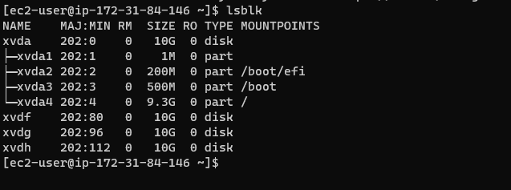

### Partioning Block Devices
`sudo gdisk /dev/xvdf`
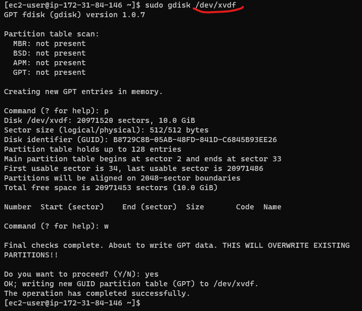

### Entire View of all Partitioned Block
`lsblk`
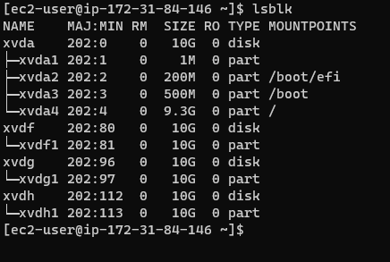

### LVM2 Installation
`sudo yum install lvm2`
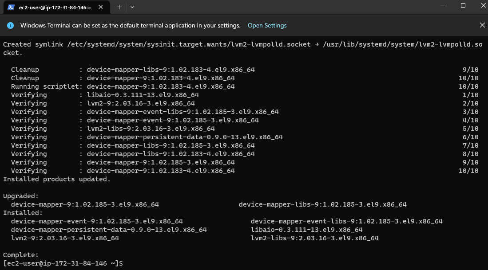

### LVM2 Installed
`which lvm`
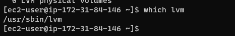

### Marking the Partitions as Physical Volumes
`sudo pvcreate /dev/xvdf1 /dev/xvdg1 /dev/xvdh1`
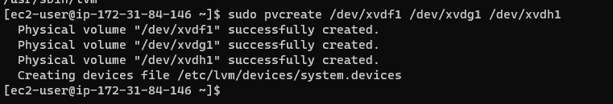

### Physical-volumes-created
`sudo pvs`
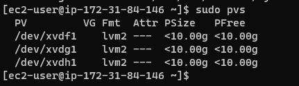

### Creating-Volume-Group
`sudo vgcreate webdata-vg /dev/xvdh1 /dev/xvdg1 /dev/xvdf1`
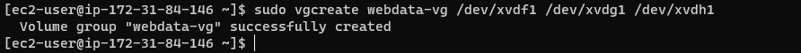

### Volume-Group-Successfully-Created
`sudo vgs`
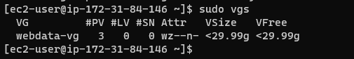

### Creating-Logical-Volumes
`sudo lvcreate -n apps-lv -L 14G webdata-vg`
`sudo lvcreate -n logs-lv -L 14G webdata-vg`
`sudo lvs`
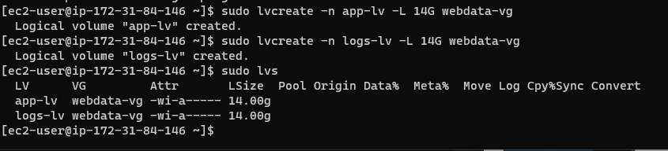

### Formatting-Logical-Volumes-with-EXT4-Filesystem
`sudo mkfs -t ext4 /dev/webdata-vg/app-lv`
`sudo mkfs -t ext4 /dev/webdata-vg/logs-lv`
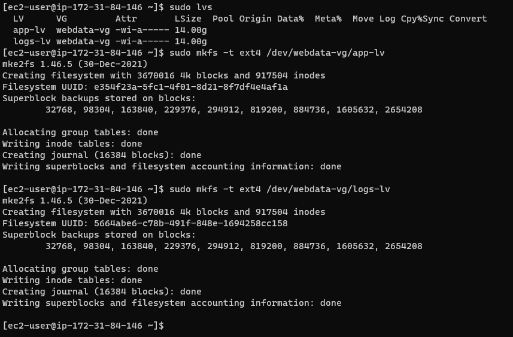

### Creating-Directory-to-Store-website-files
`sudo mkdir -p /var/www/html`
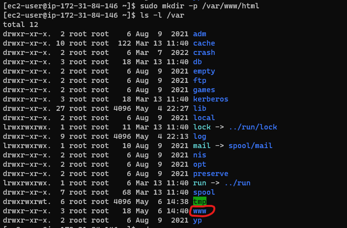

### Creating-Directory-to-Store-Log-Files
`sudo mkdir -p /home/recovery/logs`
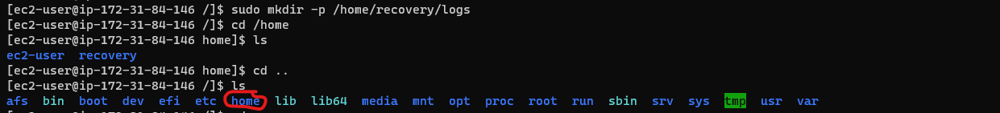

### Mounting-Website-files-directory-on-app-lv
`sudo mount /dev/webdata-vg/apps-lv /var/www/html`
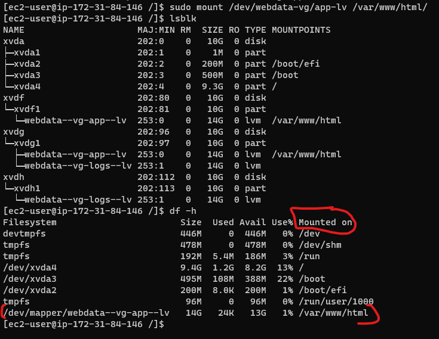

### Mounting-Log-files-directory-on-logs-lv
`sudo mount /dev/webdata-vg/logs-lv /var/log`
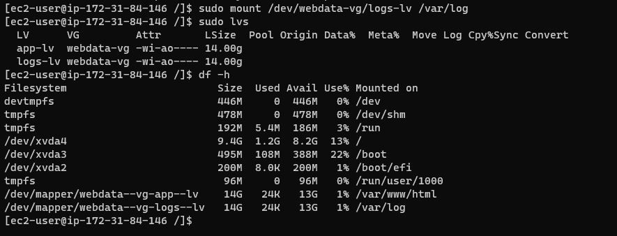

### Updating-fstab
`sudo vi /etc/fstab`
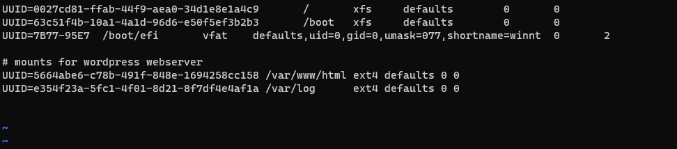

### Entire-setup-of-Volumes
`df -h`
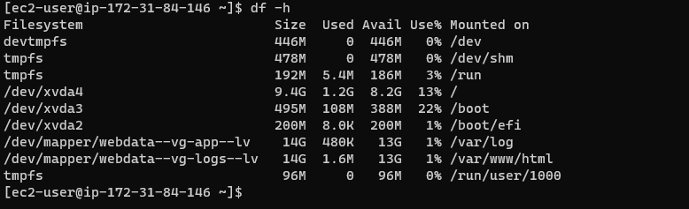

## **Preparing Database Server**

### Volumes-Attached-for-DB-Server
`lsblk`
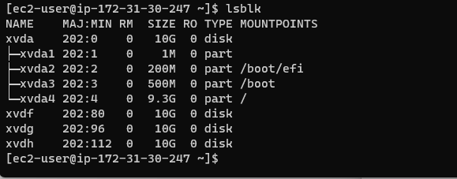

### Volumes-successfully-partitioned
`sudo gdisk /dev/xvdf`
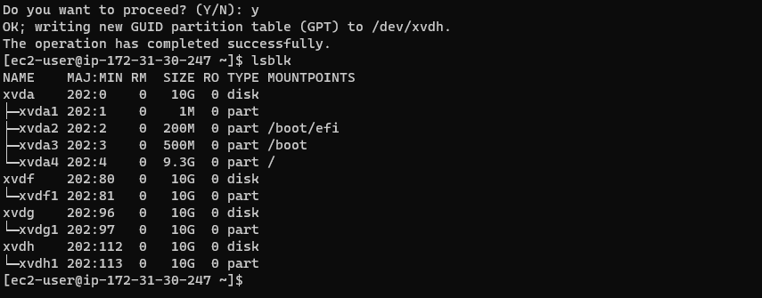

### Volumes-marked-as-physical-volumes
`sudo pvcreate /dev/xvdf1 /dev/xvdg1 /dev/xvdh1`
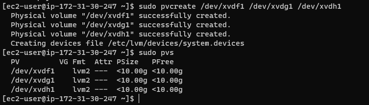

### Installing LVM2 for DB Server
`sudo yum install lvm2`
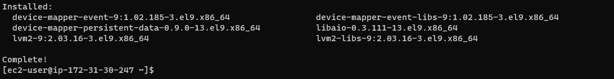

### Creating Volume Groups for DBServer
`sudo vgcreate vg-dbdatabase /dev/xvdf1 /dev/xvdg1 /dev/xvdh1`
`sudo vgs`
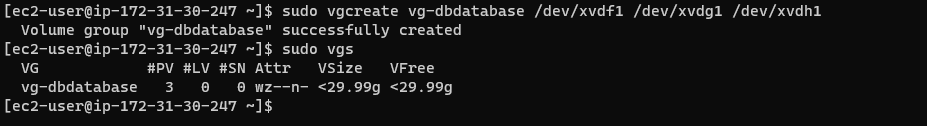

### Creating Logical Volumes
`sudo lvcreate -n db-lv -l 20G vg-dbdatabase`
`sudo vgs`
`sudo lvs`
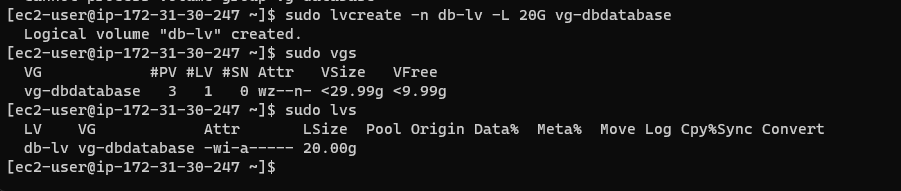

### Formatting-Logical-Volumes-with-EXT4-Filesystem
`sudo mkfs -t ext4 /dev/vg-dbdatabase/db-lv`
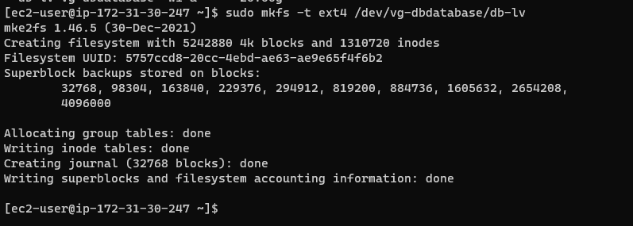

### Logical Volume Mounted on DB Directory
`sudo mount /dev/vg-dbdatabase/db-lv /db`
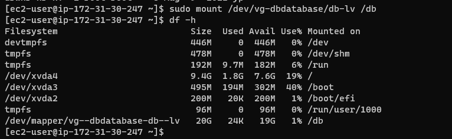

### Updating fstab for DB
`sudo vi /etc/fstab`
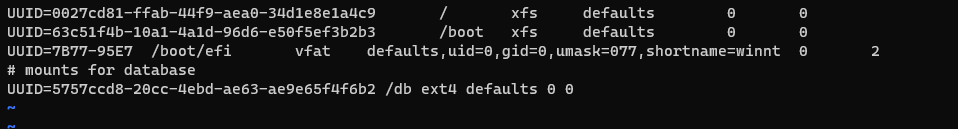
### mysql installation on DBServer
`sudo yum update`
`sudo yum install mysql-server`
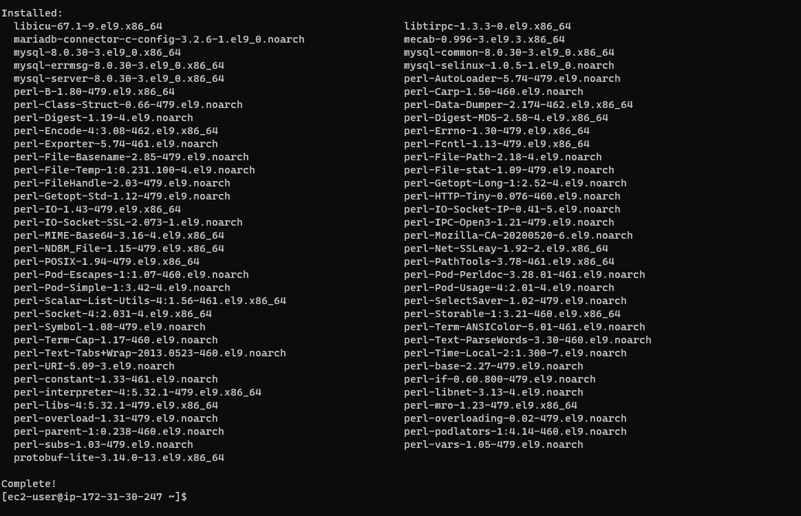